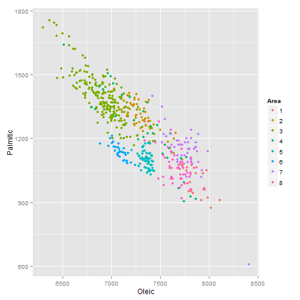

Developping Data Products : Documentation of a Shiny App
========================================================
width: 1440
height: 900
transition: none
font-family: 'Helvetica'
css: my_style.css
author: Aurelien Gmn
date: juin 19, 2015

Collecting inormations from the Box on the UI
========================================================

The UI part of the Shiny App is collecting three informations.
  - the Area : it is the perimeter of the analysis.
  - the two variables that we want to plot.

For this presentation I have simulated the input$... by creating a list.

```r
input <- list()
input$Area_sel <- c(1:8)
input$Variable1 <- "Oleic"
input$Variable2 <- "Palmitic"
```

Subseting the dataset
========================================================


To make the plot We did a subset of the orginal dataset, taking only areas on the selection and keeping only 3 variables on the working table oli.


```r
library(pgmm)
data(olive)
oli <- subset(olive, Area %in% input$Area_sel, c(input$Variable1, input$Variable2, "Area"))
```
- we do a selection of the variable that are importants
- we put Area as a factor for the plot
- we can lunch the ploting code.

```r
library(ggplot2)
oli$Area <- as.factor(oli$Area)
qplot(x=oli[,1], y=oli[,2], data=oli,colour=Area, xlab=input$Variable1, ylab=input$Variable2)
```


Plotting the variables
========================================================

 

Calculating the means for each Area
========================================================


```r
    oli <- subset(olive, Area %in% input$Area_sel, c(input$Variable1, input$Variable2, "Area"))
    m1 <- aggregate(oli[,1], by=list(oli$Area), mean)
    m2 <- aggregate(oli[,2], by=list(oli$Area), mean)
    print(setNames(cbind(m1, m2[,2]), c("Area",input$Variable1, input$Variable2)))
```

```
  Area    Oleic Palmitic
1    1 7820.400 1027.000
2    2 7307.179 1302.232
3    3 6911.209 1395.670
4    4 7357.833 1228.361
5    5 7360.538 1097.723
6    6 7085.788 1138.182
7    7 7746.000 1145.400
8    8 7674.200 1052.800
```
